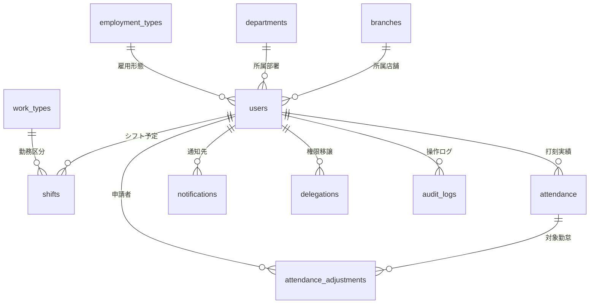

# データベース設計書

このドキュメントでは、シフト・勤怠管理アプリで使用しているデータベースの構成を説明します。

どのような情報を保存しているのか、各データがどのようにつながっているのか、勤怠打刻や修正申請の流れに沿って確認できる内容にしています。

---

## 1. データベース概要

このアプリでは、利用する環境に応じて2種類のデータベースを使い分けています。

開発中やテスト時には、手軽に動作確認ができる **H2 Database** を使用しています。想定本番構成では **Supabase PostgreSQL** を使用します。現在の接続先や稼働状態はリポジトリだけでは確認できないため、共有時に別途確認が必要です。

### 環境が変わっても動きやすくするための工夫

* **IDの作り方を統一**: 各テーブルの主キーである `id` は、H2 Database と PostgreSQL のどちらでも使える形式にしています。これにより、開発環境と本番環境で同じように動作しやすくしています。
* **テーブルを自動で準備**: アプリ起動時に `Database.java` が必要なテーブルを確認し、足りない場合は自動で作成します。そのため、手作業でデータベースを準備する負担を減らしています。

---

## 2. 主要テーブル一覧

このアプリでは、シフト、勤怠、通知、権限管理などの情報を、それぞれ専用のテーブルに分けて管理しています。

以下は、主要機能と勤怠修正の流れを理解するための抜粋であり、データベースに存在する全テーブルの一覧ではありません。有休申請・承認・残数管理などの基本機能も実装済みですが、ここでは代表的なテーブルを中心に説明します。

| テーブル名 | 管理している内容 | 主な項目 |
| :--- | :--- | :--- |
| **`users`** | システムを利用する従業員情報 | 社員番号、氏名、メールアドレス、パスワードハッシュ、権限、所属拠点、部署 |
| **`branches`** | 店舗や営業所の情報 | 拠点名、有効／無効の状態 |
| **`departments`** | 部署の情報 | 部署名、有効／無効の状態 |
| **`employment_types`** | 雇用形態の情報 | 正社員、パートなどの雇用形態名、有効／無効の状態 |
| **`work_types`** | 勤務区分の情報 | 日勤、夜勤、休みなどの勤務コード、開始・終了時間、休憩時間、必要人数の目安 |
| **`shifts`** | 確定した勤務予定 | 従業員ID、勤務日、勤務コード、メモ、確定状況 |
| **`attendance`** | 毎日の出退勤記録 | 従業員ID、勤務日、出勤・退勤時刻、位置情報の判定、確定状態 |
| **`attendance_adjustments`** | 打刻修正の申請内容 | 対象となる勤怠ID、申請者ID、修正希望時刻、理由、承認状況 |
| **`notifications`** | 従業員へのお知らせ | 通知先、通知の種類、件名、本文、リンク先、既読状態 |
| **`delegations`** | 権限の代理設定 | 権限を渡す人、受け取る人、開始日、終了日、有効状態 |
| **`audit_logs`** | 管理者操作の記録 | 操作した人、操作内容、対象データ、変更前後の内容 |

---

## 3. ER図（データ同士のつながり）

以下の図は、主要なテーブル同士がどのようにつながっているかを示したものです。

たとえば、従業員情報である `users` は、シフト、勤怠実績、通知、操作ログなど、さまざまなデータと関連しています。

---

## 4. データのつながりと処理の流れ

ここでは、実際の操作に合わせて、データがどのように登録・更新されるかを説明します。

### 4.1 出退勤を打刻したとき

* 従業員が出勤または退勤の打刻をすると、`attendance` テーブルに勤怠記録が登録されます。すでに同じ日の記録がある場合は、その記録が更新されます。
* 打刻時には、従業員情報や勤務設定をもとに、遅刻・早退などの判定を自動で行います。
* 判定結果は、勤怠記録の中に保存されます。

### 4.2 勤怠修正を申請してから承認されるまで

1. **従業員が修正申請を作成したとき**
   * `attendance_adjustments` テーブルに、申請中の状態で新しいデータが登録されます。
   * 同時に、担当範囲や権限規則に応じた承認担当者へ通知が作成されます。

2. **権限を持つ担当者が承認または却下したとき**
   * 自己承認は禁止されています。店長は担当範囲内、人事は権限規則に従って処理し、設定された代理店長が処理できる場合もあります。
   * 承認または却下を行うと、申請データの状態が更新されます。
   * 承認された場合のみ、対象となる勤怠記録の出勤時刻や退勤時刻が、申請された内容に更新されます。
   * 申請した従業員には、結果を知らせる通知が作成されます。

---

## 5. 初期データ・デモデータの説明

このアプリは、初めて起動したときやデモ環境で確認するときに、必要な基本データを自動で用意できる仕組みにしています。

これにより、手作業で多くのデータを登録しなくても、ログイン後すぐに画面表示や申請・承認の流れを確認できます。

### 5.1 組織マスタデータの自動登録

データベースが空の状態でアプリを起動すると、店舗、部署、勤務区分などの基本データが自動で登録されます。

たとえば、本社、那覇支店、北部支店などの拠点情報や、営業部、経理部などの部署情報、日勤・夜勤・休みといった勤務区分が用意されます。

### 5.2 デモアカウントの自動作成

本番環境や検証環境で `DEMO_ACCOUNTS_ENABLED=true` を設定すると、各拠点の店長アカウントや一般従業員アカウントなどのテスト用データが自動で作成されます。

これにより、ログイン後すぐに、実際の運用に近い形で画面表示や承認フローを確認できます。

※デモアカウントに設定する共通パスワード（`DEMO_ACCOUNTS_PASSWORD`）などの実際の値は、セキュリティ保護のため公開リポジトリには載せません。環境変数やデモ確認用の別資料で管理します。
