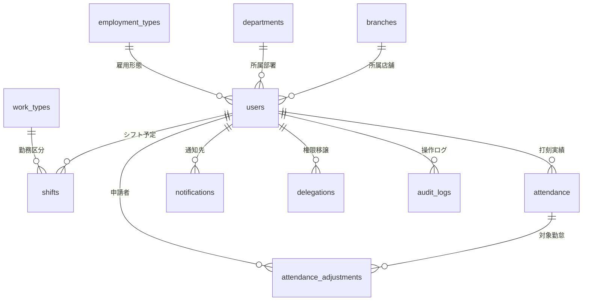

# データベース設計書

本ドキュメントは、本アプリケーションにおけるデータベース設計、主要テーブルの定義、およびデータの関連性について解説したものです。

---

## 1. データベース概要

本システムでは、開発環境およびテスト実行時にはファイルベースで手軽に動作する **H2 Database** を使用し、本番環境（クラウドデプロイ時）には堅牢でスケーラブルな **Supabase PostgreSQL** を利用するハイブリッド構成をとっています。

### 接続仕様の統一
* **自動採番の統一**: すべてのテーブルの主キー (`id`) には、H2 と PostgreSQL の双方で互換性のある `BIGINT GENERATED BY DEFAULT AS IDENTITY` を使用しています。
* **スキーマ初期化**: アプリケーション起動時に `Database.java` クラスによって自動的にテーブルが検証・生成されるため、手動でのスキーマ作成が不要です。

---

## 2. 主要テーブル一覧

アプリケーションの主要な動作（シフト・勤怠・通知・権限管理）を支えるテーブル群を定義しています。（※有休関連のテーブル群は将来の機能拡張用としてスキーマ上に用意されていますが、本ドキュメントでは主要機能に関連するテーブルに限定して説明します。）

| テーブル名 | 用途・役割 | 主なカラム |
| :--- | :--- | :--- |
| **`users`** | システムを利用するすべての従業員データ | 社員番号、氏名、メールアドレス、パスワードハッシュ、ロール権限、所属店舗、部署 |
| **`branches`** | 店舗や営業所のマスタデータ | 拠点名、有効フラグ |
| **`departments`** | 所属する部署のマスタデータ | 部署名、有効フラグ |
| **`employment_types`** | 雇用形態（正社員、パートなど）のマスタ | 雇用形態名、有効フラグ |
| **`work_types`** | 勤務区分（日勤、夜勤、休み）の定義 | 勤務コード、開始・終了時間、休憩時間、必要人数目安 |
| **`shifts`** | 従業員の確定した勤務予定データ | 従業員ID、勤務日、勤務コード、メモ、確定状況 |
| **`attendance`** | 毎日の出退勤の打刻実績データ | 従業員ID、勤務日、出勤・退勤日時、位置情報判定、確定フラグ |
| **`attendance_adjustments`** | 従業員から送信される打刻修正の申請データ | 対象勤怠ID、申請者ID、修正希望日時、理由、判定ステータス |
| **`notifications`** | 従業員へ送られるお知らせや申請結果の通知 | 宛先従業員ID、通知種別、件名、本文、リンク先URL、既読フラグ |
| **`delegations`** | 店長から一般従業員への権限移譲設定 | 移譲元ID、移譲先ID、開始・終了日、有効フラグ |
| **`audit_logs`** | 管理者による操作の履歴を記録する監査ログ | 操作者ID、操作名、対象オブジェクト、変更前後の値 |

---

## 3. ER図（Entity-Relationship Diagram）

Mermaid記法による主要テーブル間の関連性を示します。

---

## 4. データの関連とデータの流れ

本システムにおける主要な業務フローに対応したデータの変遷を解説します。

### 4.1 出退勤打刻時のデータの流れ
* 従業員が打刻を行うと、`attendance` テーブルにレコードが追加（または既存レコードが更新）されます。
* 打刻時、所属する `users` テーブルの情報をもとに、その従業員の初期設定された遅刻・早退閾値に沿って自動判定が行われ、`attendance.status` や `attendance.location_status` などのカラムに結果が格納されます。

### 4.2 勤怠修正申請から承認までのデータの流れ
1. **申請作成時**:
   * `attendance_adjustments` にステータス `PENDING` で新規レコードが作成されます。
   * 同時に、承認権限のある店長（`users.role = MANAGER`）を宛先としたレコードが `notifications` に追加されます。
2. **店長による判定時**:
   * 店長が承認ボタンを押すと、`attendance_adjustments.status` が `APPROVED`（却下の場合は `REJECTED`）に更新され、判定日時と店長IDが保存されます。
   * **承認時のみ**: 紐づいている `attendance` テーブルの対象レコードの `clock_in` / `clock_out` 時間が、申請された修正後の値に更新されます。
   * 申請者の従業員に対して結果を伝える `notifications` が新規に生成されます。

---

## 5. 初期データ・デモデータの説明

本システムは、初期テストや閲覧時における利便性を考慮し、起動時に自動でデモ環境が整う仕組みを備えています。

### 5.1 組織マスタデータの自動投入
DBが空の状態でシステムが起動された場合、`branches` (本社、那覇支店、北部支店など) や `departments` (営業部、経理部など)、`work_types` (日勤、夜勤、休み) が自動的にシードされます。

### 5.2 デモアカウントの生成に関する設定（DEMO_ACCOUNTS_ENABLED）の説明
本番環境や検証環境において、環境変数 `DEMO_ACCOUNTS_ENABLED=true` を設定しておくことで、各拠点（本社＋6支店）のテストデータ（店長アカウント、一般従業員アカウント）が自動でデータベース内に構築されます。
これらにより、ログイン直後から本番の挙動に近い形で画面表示や承認プロセスのテストを行うことが可能です。

※デモアカウントに設定される共通パスワード（`DEMO_ACCOUNTS_PASSWORD`）などの実値は、セキュリティ保護のため公開リポジトリにはコミットせず、環境変数およびデモ用ドキュメントとして別途共有・管理する設計になっています。
