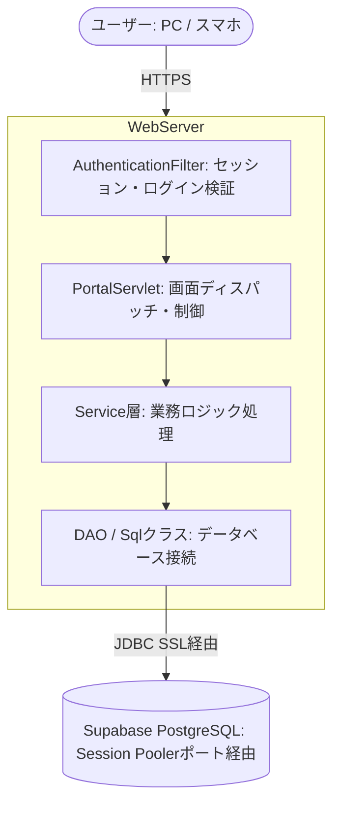

# システム設計書

本ドキュメントは、本アプリケーションのシステム構成、アプリケーション構成、画面遷移設計、およびクラス設計について解説したものです。

---

## 1. システム構成

本システムは、軽量な実行コンテナとクラウドデータベースを活用し、本番環境においても安定して稼働する設計を採用しています。



* **ホスティング**: Render Web Service
  * Dockerコンテナを利用し、Tomcat 10.1 と Java 21 の実行環境をパッケージ化して動作させています。
* **データベース**: Supabase PostgreSQL
  * 本番接続時には、接続効率の向上と接続の安定化を図るため、**Supabase Session Pooler** を経由したJDBC接続を採用しています。

---

## 2. アプリケーション構成 (MVCモデル)

本システムは、JSP/Servletの標準的なアーキテクチャに基づいたシンプルなMVCモデルで構築されています。

* **Model**: データのエンティティオブジェクト（`User` など）およびビジネスロジックを実行するService層。
* **View**: `WEB-INF/jsp/app.jsp` を中心とするJSPファイル。CSSおよびJavaScriptを組み合わせてレスポンシブな画面を生成します。
* **Controller**: HTTPリクエストを処理し、適切なビジネスロジックの呼び出しと画面遷移（ディスパッチ）を行うServlet層。

### 各レイヤーの役割
* **Filter (フィルター層)**: `AuthenticationFilter.java` など。すべてのアクセスを横断的に監視し、未ログイン時のリダイレクト制御やセクション状態の保護を行います。
* **Servlet (コントローラー層)**: `PortalServlet.java` および `AuthServlet.java`。URLに対応するタイトルの設定、画面表示に必要なデータのロード、JSPへのフォワード（`doGet`）、および画面からのフォーム送信（`doPost`）のアクション処理を行います。
* **Service (サービス層)**: `AttendanceService.java`、`ShiftService.java` などの業務ロジッククラス。トランザクションの開始、各種検証チェック、およびDAO層の呼び出しを担当します。
* **DAO / Sql (データアクセス層)**: データベース接続ヘルパークラス（`Sql.java`）。プレパードステートメントを用いたSQLクエリの実行と結果のマップ変換を行います。

---

## 3. ディレクトリ構成

```text
dokoTsubu-master/
├── src/
│   ├── main/
│   │   ├── java/
│   │   │   ├── config/        # データベースの接続設定・初期シードデータ構築
│   │   │   ├── dao/           # データアクセスヘルパー（Sql.java）
│   │   │   ├── filter/        # セッションおよびセキュリティ認証用フィルター
│   │   │   ├── model/         # データモデル（User.java）
│   │   │   ├── service/       # 各機能のロジック（AttendanceService, ShiftServiceなど）
│   │   │   └── servlet/       # コントローラー（PortalServlet, AuthServletなど）
│   │   └── webapp/
│   │       ├── assets/        # 静的ファイル（CSS, JavaScript）
│   │       └── WEB-INF/
│   │           └── jsp/       # 各機能の描画を統合したメインレイアウト（app.jsp）
```

---

## 4. 権限ごとの利用可能機能マトリクス

`PortalServlet.java` の `allowed` メソッド等により、ロールに応じた厳格な機能制限（アクセス制御）を行っています。

| 機能（画面パス） | 内容 | 従業員 (EMPLOYEE) | 店長 (MANAGER) | 人事 (HR) |
| :--- | :--- | :---: | :---: | :---: |
| `dashboard` | 概要・通知表示・月間シフト | ◯ | ◯ | ◯ |
| `attendance/clock` | 出退勤の打刻 | ◯ | ◯ | ◯ |
| `attendance/mine` | 自身の勤怠実績確認 | ◯ | ◯ | ◯ |
| `attendance/adjust` | 勤怠修正の申請作成 | ◯ | ◯ | ◯ |
| `attendance/history` | 自身の申請履歴 | ◯ | ◯ | ◯ |
| `shifts/mine` | 自身の確定シフト確認 | ◯ | ◯ | ◯ |
| `attendance/manage` | 所属スタッフの月次確定 | ✕ | **◯** | **◯** |
| `shifts/manage` | カレンダーでのシフト作成・調整 | ✕ | **◯** | **◯** |
| `employees` | 従業員アカウント管理 | ✕ | ✕ | **◯** |
| `masters/*` | 各種マスタデータ整備 | ✕ | ✕ | **◯** |

---

## 5. 主要な処理フロー

### 5.1 出退勤打刻処理
従業員がポータル画面から「出勤」または「退勤」ボタンを押した際の流れです。

1. **Servlet (`PortalServlet.doPost`)** が `action=clock` および打刻区分（`direction`）を受信。
2. **Service (`AttendanceService.clock`)** を呼び出す。
   * 現在時刻を取得し、すでに打刻済みでないかを検証。
3. **DB操作 (`Sql.java` / `attendance` テーブル)**:
   * その日のレコードがなければ新規作成し出勤時刻を記録、退勤であれば既存レコードの退勤時刻を更新。
   * シフトデータと突き合わせを行い、遅刻・早退の判定を自動算出。
4. **リダイレクト**: 打刻完了後、元の打刻画面へリダイレクトして最新の打刻時間を表示。

### 5.2 勤怠修正申請の承認・却下処理
店長が従業員から届いた修正申請を判断する際の流れです。

1. **Servlet (`PortalServlet.doPost`)** が `action=decideAttendanceAdjustment` アクションを受信。
2. **Service (`AttendanceService.decideAttendanceAdjustment`)** を呼び出し、判定処理を実行。
   * **権限検証**: 操作者が MANAGER または HR ロールであること、さらに MANAGER の場合は申請者と同じ店舗・部署に所属していることを検証（他店舗データの操作を防止）。
   * **重複検証**: すでに「承認」または「却下」済みになっていないか（PENDING状態であること）を検証。
3. **DB操作 (`Sql.java` / `attendance_adjustments`, `attendance` テーブル)**:
   * 承認の場合：`attendance` テーブルの該当打刻レコードを申請時間に更新。
   * 却下の場合：`attendance` テーブルは変更せず、申請ステータスを却下（REJECTED）に変更。
4. **通知処理 (`NotificationService`)**:
   * 申請者の従業員に対して、承認/却下結果のシステム通知（遷移URL付き）を作成。
5. **リダイレクト**: 承認処理完了後、管理用の一覧画面へリダイレクト。

---

## 6. 設計上工夫した点

* **共通ポータルによる統合表示 (`app.jsp`)**
  * 各種画面の描画を `app.jsp` に集約し、ナビゲーションメニューやヘッダーを共通化しています。これにより画面デザインの一貫性を高めるとともに、ロールに応じた表示切り替え処理をシンプルに保っています。
* **データベースアクセスのカプセル化**
  * `Sql.java` を用意し、コネクションの取得・解放処理を共通化することで、Serviceクラスにおけるリソースリーク（接続漏れ）を防ぐとともに、SQLインジェクション対策のバインド変数処理を徹底しています。
* **ビジネスルールとコントローラーの分離**
  * リクエスト値の取得や画面遷移制御は Servlet（コントローラー）が行い、業務ロジックの判定、検証チェック、通知の生成は Service クラスが行うよう分離することで、プログラムの変更や検証がしやすい構成にしています。
