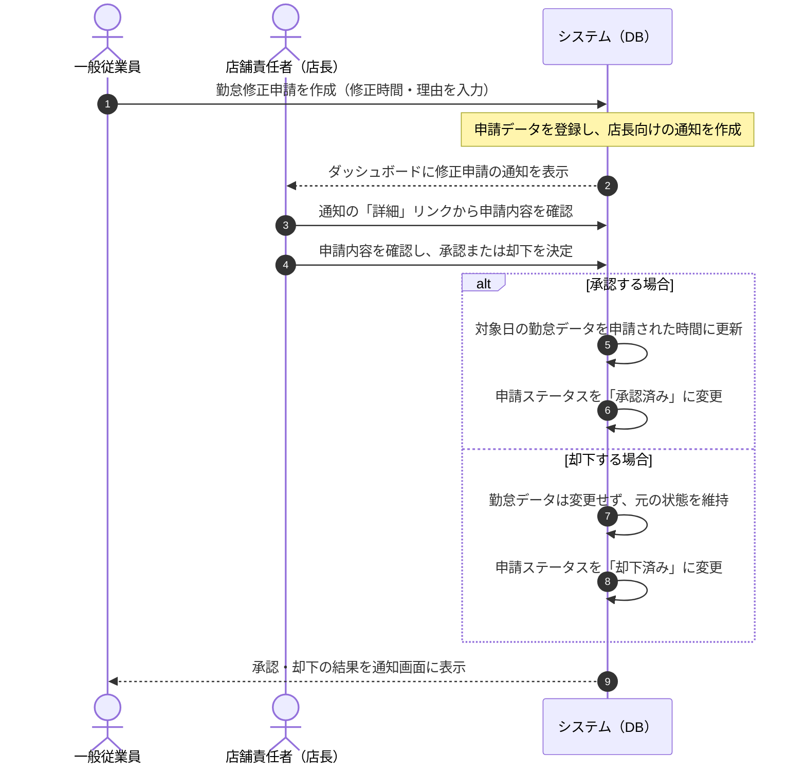

# 要件定義書

このドキュメントでは、シフト・勤怠管理アプリで実現したいことや、利用者ごとの役割、主な機能についてまとめています。

アプリの目的や使い方の全体像を、開発者以外の方にも確認しやすいように整理しています。

---

## 1. 開発背景と解決したい課題

店舗や事業所では、スタッフの勤務予定（シフト）と、実際に働いた時間（勤怠）を管理する必要があります。

しかし、紙や表計算ソフトでシフトを作成し、別の方法で勤怠を確認していると、店長や人事担当者の作業負担が大きくなりやすいです。

### 解決したい課題

* **シフトと勤怠の二重管理**: 紙や表計算ソフトで作成したシフトと、実際の勤怠データを手作業で照合すると、転記ミスや確認漏れが起きやすくなります。
* **申請・承認の遅れ**: 打刻ミスや打刻漏れがあった場合、口頭や紙で申請・承認を行うと、対応状況がわかりにくくなり、処理が遅れる可能性があります。
* **権限管理の不安**: 従業員が他の人のシフトを編集できてしまったり、店長が別店舗のデータを操作できてしまったりすると、安全な運用が難しくなります。

このアプリでは、**シフト作成・調整、出退勤打刻、月ごとの勤怠確認、勤怠修正申請と承認の流れ**をWeb上でまとめて管理できるようにしています。

また、一般従業員・店長・人事といった役割ごとに、見られる画面や操作できる機能を分けることで、安全に使えることを目指しています。

---

## 2. 想定ユーザーと権限

このアプリでは、ログインした人の役割に応じて、表示される画面や使える機能が自動で切り替わります。

| 役割 | 主な役割 | できること |
| :--- | :--- | :--- |
| **一般従業員 (EMPLOYEE)** | 自分のシフトや勤怠を確認する人 | 自分の確定シフトの確認、出勤・退勤の打刻、打刻ミスがあった場合の修正申請。 |
| **店舗責任者・店長 (MANAGER)** | 自店舗のスタッフや勤怠を管理する人 | 自店舗スタッフのシフト作成・調整、勤怠修正申請の承認・却下、自店舗の月次勤怠確認。 |
| **人事担当者 (HR)** | 全体の従業員情報や設定を管理する人 | 従業員アカウントの登録・編集、店舗・部署・勤務区分などの基本設定、全社の勤怠実績の確認。 |

---

## 3. 機能要件

このアプリで使える主な機能は、以下のとおりです。

### 3.1 権限管理・ログイン

* メールアドレスとパスワードでログインします。
* ログイン後は、一般従業員・店長・人事など、それぞれの役割に合った画面を表示します。
* ログアウトすると利用状態がリセットされ、ログインしていない状態では保護された画面にアクセスできないようにします。

### 3.2 出退勤打刻

* 従業員は、Web画面のボタンから出勤・退勤の時刻を記録できます。
* 打刻した時刻は勤怠実績としてすぐに保存されます。
* 確定しているシフトと打刻時刻を比べて、遅刻や早退があるかを確認できるようにしています。

### 3.3 シフト作成・調整

* 店長や人事は、スタッフの月間シフトを作成・調整できます。
* 日勤、夜勤、休みなどの勤務区分を、カレンダー形式の画面などから選択して保存できます。
* 従業員は、自分に確定されたシフトをいつでも確認できます。

### 3.4 勤怠修正申請の作成と承認・却下

* 従業員は、打刻漏れや打刻ミスがあった場合に、修正したい時刻と理由を入力して申請できます。
* 申請が送られると、店長または人事に通知されます。
* 店長または人事は、申請内容を確認して承認・却下を判断できます。
* 承認された場合は、勤怠実績が申請内容に合わせて更新されます。
* 却下された場合は、元の勤怠データがそのまま維持されます。

### 3.5 通知機能

* 従業員が勤怠修正申請を送ると、店長の画面に通知が表示されます。
* 店長が承認・却下を行うと、申請した従業員に結果が通知されます。
* 通知内のリンクから、対象の申請や結果確認画面へ移動できます。

### 3.6 月次の勤怠確認

* 店長や人事は、対象月のスタッフの勤怠実績を一覧で確認できます。
* 従業員ごとの合計労働時間、遅刻・早退、残業時間などを確認できます。
* 月ごとの勤怠を確認し、締め処理（月次確定）を行えるようにしています。

---

## 4. 非機能要件

機能そのものだけでなく、安全性や使いやすさについても、以下の点を意識しています。

* **セキュリティ・アクセス制御**: URLを直接入力して本来見られない画面へアクセスしようとした場合でも、サーバー側で権限を確認し、アクセスを制限します。
* **情報保護**: システムエラーやページが見つからない場合でも、プログラムの詳しいエラー内容やデータベース接続情報などが画面に表示されないようにします。
* **スマートフォンでの見やすさ**: 店舗などでスマートフォンから出退勤打刻やシフト確認を行えるよう、画面幅に合わせて見やすく表示されるようにします。
* **データ管理**: 本番環境でも安定して使えるように、データベースへの接続方法やデータの整合性に配慮しています。

---

## 5. 主要な画面一覧

アプリで使用する主な画面は、以下のとおりです。

* **ログイン画面 (`/index.jsp`)**: メールアドレスとパスワードを入力してログインする画面です。
* **ポータル画面（ダッシュボード）**: ログイン後に最初に表示される画面です。お知らせ、通知、当月のシフトなどを確認できます。
* **シフト画面 (`shifts/mine`)**: 従業員が自分の確定シフトを確認する画面です。
* **シフト調整画面 (`shifts/manage`)**: 店長や人事が、カレンダー形式でスタッフの勤務予定を作成・調整する画面です。
* **出退勤打刻画面 (`attendance/clock`)**: 出勤・退勤ボタンを押して、勤務開始・終了時刻を記録する画面です。
* **勤怠修正申請画面 (`attendance/adjust`)**: 従業員が打刻漏れや打刻ミスを修正申請する画面です。
* **月次確定・勤怠確認画面 (`attendance/manage`)**: 店長や人事が、スタッフの月ごとの勤怠実績を確認し、締め処理を行う画面です。
* **従業員一覧・マスタ管理画面**: 人事が、従業員アカウントや店舗・部署・勤務区分などの基本設定を管理する画面です。

---

## 6. 業務フロー（打刻修正申請と承認の流れ）

打刻漏れや打刻ミスがあった場合の、申請から承認・却下までの流れです。

