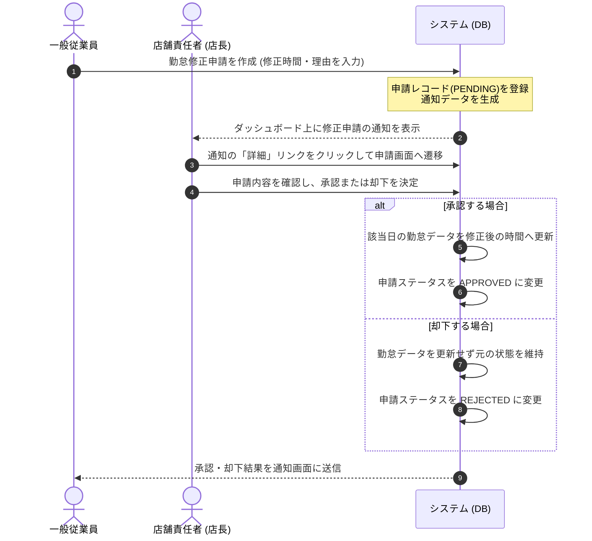

# 要件定義書

本ドキュメントは、本アプリケーションにおける業務要件およびシステム要件を定義したものです。

---

## 1. 開発背景と解決したい課題

店舗や事業所などの現場において、スタッフの勤務予定（シフト）と毎日の実際の就業記録（勤怠）を管理する業務は、店舗責任者（店長）や人事担当者の大きな負担となっています。

### 解決したい課題
* **二重管理の工数**: 紙や表計算ソフトで個別にシフトを作成し、別の勤怠管理システムと手動で突き合わせる作業による転記ミスや確認作業の非効率さ。
* **申請・承認手続きの遅延**: 打刻ミスや打刻漏れに対する修正申請、およびそれに対する店長の承認プロセスが口頭や紙で行われることによる管理漏れや遅れ。
* **権限チェックの不備**: 従業員が他人のシフトを編集してしまったり、店長が別店舗のデータを操作してしまったりするセキュアでない運用の是正。

本システムでは、これらの課題を解決するため、**「シフト作成・調整」「出退勤打刻」「月次の勤怠確認」「勤怠修正申請・承認フロー」**をWeb上で一元化し、ロール（権限）に基づいたアクセス制御のもとで安全かつ効率的に運用できるようにすることを目指して開発されました。

---

## 2. 想定ユーザーと権限ロール

本システムでは、ログインしたアカウントの権限ロールに応じて、利用できる画面や操作可能な機能が自動的に切り替わります。

| ロール（権限） | 主な役割 | 表示されるメニューと操作可能範囲 |
| :--- | :--- | :--- |
| **一般従業員 (EMPLOYEE)** | 自身の勤務実績とシフトの管理 | 自身の確定シフトの確認、毎日の出退勤打刻、過去の打刻ミスに対する修正申請の作成。 |
| **店舗責任者 (MANAGER)** | 自店舗の運営と従業員管理 | 自店舗スタッフのシフト作成・調整、スタッフからの勤怠修正申請の承認・却下、自店舗の月次勤怠確認。 |
| **人事担当者 (HR)** | 全社の情報管理とマスター整備 | 従業員アカウントの登録・編集、マスタデータ（拠点・部署・勤務区分など）の整備、全社の勤怠実績の監視。 |

---

## 3. 機能要件

主要な機能として以下を定義し、実装しています。

### 3.1 権限管理・ログイン
* ログイン画面からメールアドレスとパスワードによる認証を行い、各ロールに応じたポータル画面を表示します。
* ログアウトを実行するとセッションが破棄され、未ログイン状態では保護された画面（`/app/*`）にアクセスできないようにします。

### 3.2 出退勤打刻
* 従業員が勤務開始時および終了時に、Web画面のボタン操作により現在時刻を打刻します。
* 打刻されたデータは出退勤の実績時間として即座に記録され、遅刻や早退の判定が行われます。

### 3.3 シフト作成・調整
* 店舗責任者（店長）および人事が、所属従業員の月間勤務予定（シフト）を入力・保存します。
* 各日付の勤務区分（日勤、夜勤、休みなど）をカレンダーUI等の画面上で選択し、確定した予定として保存できます。
* 従業員は自身に確定されたシフトをいつでも確認できます。

### 3.4 勤怠修正申請の作成と承認・却下
* 従業員は打刻漏れや打刻ミスがあった場合、過去の勤怠実績に対して、修正希望日時と理由を入力して申請を作成できます。
* 申請が行われると、店舗責任者（または人事）へ通知され、申請内容を承認または却下できます。
* 承認された場合は勤怠実績が申請された日時に更新され、却下された場合は元の勤怠データが変更されずに維持されます。

### 3.5 通知機能
* 従業員が修正申請を送信した際、店舗責任者のポータル（ダッシュボード）に通知メッセージが表示されます。
* 店舗責任者が承認・却下を決定した際、申請元の従業員にその結果が通知されます。通知内のリンクから直接結果確認画面へ遷移できます。

### 3.6 月次の勤怠確認
* 店舗責任者および人事は、対象月に所属する従業員の実績データを月単位で確認できます。
* 従業員ごとの合計労働時間、遅刻・早退・残業時間などを一覧で確認し、締め処理（月次確定）を行います。

---

## 4. 非機能要件

* **セキュリティ・アクセス制御**: URLを直接書き換えるなどの不正アクセス操作をサーバー側で検知し、自身の権限外の画面（例：従業員が店長専用画面にアクセスする等）には403 Forbidden（アクセス制限）を返すように設計します。
* **情報保護**: システムエラーやURLが見つからない場合のエラー発生時に、プログラムの内部情報（スタックトレースやデータベース接続情報など）が画面に表示されないように保護します。
* **画面表示の配慮**: 一般従業員が店舗等でのモバイル端末から出退勤打刻やシフトの確認を行えるよう、画面レイアウトをスマートフォンの画面幅に合わせたレスポンシブな表示に対応させます。
* **データ管理**: 本番環境におけるデータの整合性を維持するため、データベース接続の効率化とセッション接続の最適化を組み込みます。

---

## 5. 主要な画面一覧

* **ログイン画面 (`/index.jsp`)**: アカウント認証用の画面。
* **ポータル画面（ダッシュボード）**: ログイン直後に遷移するメイン画面。権限に応じたお知らせや通知、当月のシフト表などが表示されます。
* **シフト画面 (`shifts/mine`)**: 従業員自身が自身の確定シフトを確認する画面。
* **シフト調整画面 (`shifts/manage`)**: 店長・人事がカレンダー形式でスタッフの勤務予定を作成・調整する画面。
* **出退勤打刻画面 (`attendance/clock`)**: 出勤および退勤のボタン操作を行う打刻画面。
* **勤怠修正申請画面 (`attendance/adjust`)**: 従業員が過去の打刻漏れ等を修正申請する画面。
* **月次確定・勤怠確認画面 (`attendance/manage`)**: 店長・人事がスタッフの月次の実績を確認し、確定処理を行うための画面。
* **従業員一覧・マスタ管理画面**: 人事がアカウント登録や各種マスタデータを編集する管理画面。

---

## 6. 業務フロー（打刻修正申請と承認の流れ）

