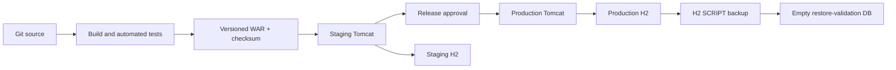

# ShiftFlow 環境構成設計

## 基本方針

開発、テスト、ステージング、本番は、Tomcatの実行領域、H2データディレクトリ、SMTP認証情報、ログ、バックアップを共有しない。同じコミットから生成したWARをステージングで検証し、同一成果物を本番へ昇格する。

## 環境マトリクス

| 項目 | 開発 | 自動テスト | ステージング | 本番 |
|---|---|---|---|---|
| 用途 | 開発者の機能確認 | 変更ごとの回帰試験 | 本番同等の受入・移行確認 | 利用者向け業務処理 |
| Tomcat | `.tomcat` | 原則起動せずサービス層を試験 | 専用`CATALINA_BASE` | 専用`CATALINA_BASE`、単一稼働インスタンス |
| H2 | `.tomcat/data/shiftapp` | テストごとの一時ディレクトリ | 専用絶対パス | 専用絶対パス |
| `shiftapp.seedDemo` | `true` | `true`（本番初期化試験のみ`false`） | `false` | `false` |
| SMTP | 未設定時は送信せずoutbox確認 | 外部送信禁止 | テスト用SMTP・宛先 | 本番SMTP |
| 公開範囲 | localhost | なし | 社内・VPN等に制限 | TLS終端を経由して公開 |
| データ | デモデータ | テスト生成データ | 匿名化データまたは移行リハーサルデータ | 業務データ |
| バックアップ | 任意 | 復元自動試験 | リリース前後に取得 | 定期取得、別領域保管 |

## 必須設定

JavaシステムプロパティはTomcatサービスの起動オプションに設定する。

| 設定 | ステージング・本番の要件 |
|---|---|
| `-Dshiftapp.dataDir=<absolute-path>` | 環境専用の絶対パス。別環境と重複させない |
| `-Dshiftapp.seedDemo=false` | デモ利用者・デモマスターの投入を禁止する |
| `catalina.base` | 環境専用のconf、logs、temp、work、webappsを持つ |

SMTPは環境変数 `SHIFTFLOW_SMTP_HOST`、`SHIFTFLOW_SMTP_PORT`、`SHIFTFLOW_SMTP_SECURITY`、`SHIFTFLOW_SMTP_USER`、`SHIFTFLOW_SMTP_PASSWORD`、`SHIFTFLOW_MAIL_FROM`、`SHIFTFLOW_MAIL_FROM_NAME`、`SHIFTFLOW_MAIL_MAX_ATTEMPTS` で設定する。パスワードをリポジトリ、WAR、Tomcat設定の共有ファイル、運用手順書へ記載しない。

## 配備と昇格

1. クリーンな作業領域で `test.ps1` を実行する。
2. 合格した `target/shiftflow.war` のバージョンとSHA-256を記録する。
3. 同じWARをステージングへ配備し、移行・受入・復元検証を行う。
4. 承認済みの同一WARを本番へ配備する。本番サーバー上で再ビルドしない。
5. 配備前にH2 `SCRIPT` バックアップを取得する。DBファイルを直接コピーしない。
6. 切り戻し時も本番DBを上書き復元せず、別DBで復元確認後に承認された切り戻し手順を実施する。

## データとアクセスの境界

- H2ファイルへアクセスできるOSアカウントはTomcatサービスと運用管理者に限定する。
- H2の同一DBを複数のTomcat環境から参照しない。
- 本番データを開発・テストへ複製しない。必要な場合は承認後に匿名化したデータだけを使用する。
- ステージング・本番の初期マスターと初期人事担当者は、デモ投入ではなく承認済み移行データから登録する。
- バックアップと復元検証は [H2バックアップ・復元検証](../ops/BACKUP.md) に従う。

## 障害分離

- アプリ停止、ログ肥大化、DB容量、バックアップ失敗を環境ごとに監視する。
- ステージングの障害やメール送信が本番のDB・SMTP・通知先へ波及しない構成にする。
- 日次処理は各環境のアプリ内スケジューラーで実行されるため、本番Tomcatを複数起動しない。冗長化する場合は、先に排他制御を実装する。

