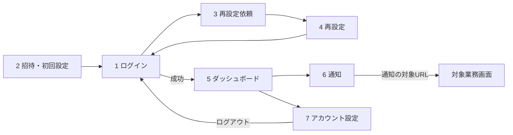
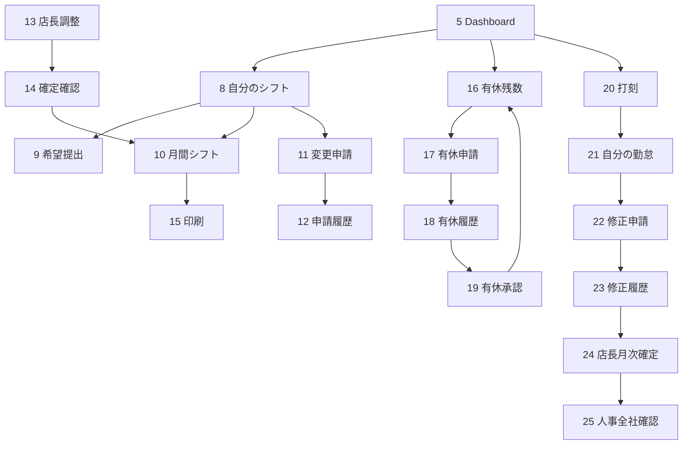
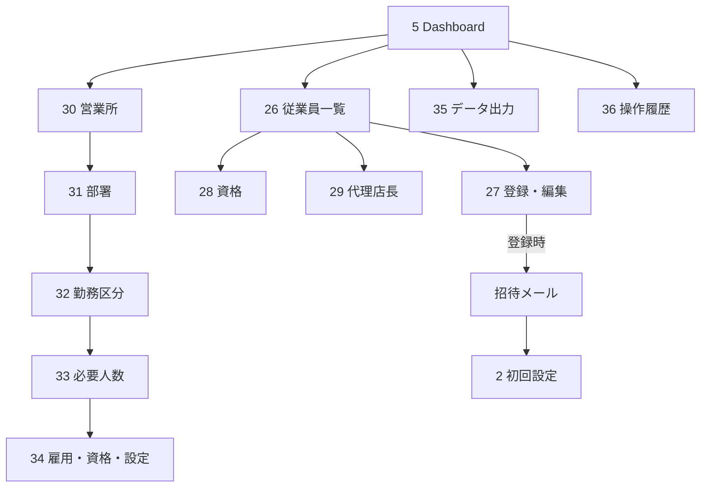

# ShiftFlow 全36画面ワイヤーフレーム・遷移設計

## 1. 表記

```text
[見出し]    画面タイトル・セクション
(入力)      テキスト、日付、選択などの入力
<操作>      ボタンまたはリンク
|一覧|      表・履歴・カードの繰返し
!状態!      成功、警告、エラー、空状態
```

すべてのログイン後画面は、[UI・レスポンシブ設計](UI_DESIGN_SYSTEM.md)の共通ヘッダー、役割別ナビ、コンテンツ、フッターを使用する。

## 2. ダッシュボード詳細ワイヤーフレーム（DES-001）

### PC

```text
┌──────────────┬──────────────────────────────────────────────────────┐
│ ShiftFlow    │ [ダッシュボード]      <通知> 利用者/所属 <設定> <終了> │
│              ├──────────────────────────────────────────────────────┤
│ 概要         │ ┌──────┐┌──────┐┌──────┐┌──────┐┌──────┐ │
│ ・Dashboard  │ │勤務者││未承認││有休残││不足  ││月時間│ │
│ ・通知       │ └──────┘└──────┘└──────┘└──────┘└──────┘ │
│              │ ┌───────────────────────┬────────────────────────┐ │
│ シフト       │ │ [6か月推移]            │ [今月の予定]           │ │
│ ・自分       │ │ 勤務 / 残業 / 有休      │ 日付 勤務区分 状態      │ │
│ ・希望       │ │       ▉ ▊ ▌             │ …最大7件 <すべて見る>  │ │
│ ・チーム     │ └───────────────────────┴────────────────────────┘ │
│ …役割別      │                                                      │
└──────────────┴──────────────────────────────────────────────────────┘
```

### スマートフォン

```text
┌──────────────────────┐
│ <☰> ダッシュボード <通知><設定> │
├──────────────────────┤
│ ┌───────┐┌───────┐ │
│ │勤務者 ││未承認 │ │
│ ├───────┤├───────┤ │
│ │有休残 ││不足   │ │
│ └───────┘└───────┘ │
│ ┌──────────────────┐ │
│ │月間勤務時間       │ │
│ └──────────────────┘ │
│ [6か月推移（横幅内）]   │
│ [今月の予定（縦並び）]   │
│ <個人情報・位置情報>      │
└──────────────────────┘
```

### 表示ルール

- 指標値は従業員本人、店長の担当営業所・部署、人事の全社という権限範囲で集計する。
- グラフは勤務時間、残業時間、有休取得日数を色とツールチップで区別する。
- データがない場合は空のグラフを描かず、説明付き空状態を表示する。
- 指標から対応一覧へ移動できる構造とし、ダッシュボードだけで更新操作は行わない。

## 3. 全36画面ワイヤーフレーム一覧（DES-002）

### 共通・認証（1〜7）

| No. | 画面 | 対象 | 主要ブロック | 状態・主遷移 |
|---:|---|---|---|---|
| 1 | ログイン | 全員 | [ブランド] (メール) (パスワード) <ログイン> <再設定> <プライバシー> | 認証失敗、試行上限。成功→5 |
| 2 | 招待確認・初回設定 | 招待者 | [リンク状態] (新パスワード) <設定> | 有効、期限切れ、使用済み。完了→1 |
| 3 | パスワード再設定依頼 | 全員 | [案内] (メール) <送信> | 登録有無を開示しない共通完了。→1/4 |
| 4 | パスワード再設定 | 対象者 | [リンク状態] (新パスワード) <設定> | 有効、期限切れ、使用済み。完了→1 |
| 5 | ダッシュボード | 全役割 | |5指標| |月別グラフ| |今月予定| | 空状態、役割別集計。各業務画面へ |
| 6 | 通知一覧 | 全役割 | <すべて既読> |通知|、人事のみ|メール状況|<再送> | 0件、未読、送信失敗。通知URL→対象詳細 |
| 7 | アカウント設定 | 全役割 | (言語) (新パスワード) <保存> | 成功、入力エラー。→5 |

### シフト（8〜15）

| No. | 画面 | 対象 | 主要ブロック | 状態・主遷移 |
|---:|---|---|---|---|
| 8 | 自分のシフト | 従業員等 | (対象月)<表示> |日付/勤務/状態| <印刷> | 0件、下書き、提出、確定。→9/11 |
| 9 | 希望シフト入力・提出 | 従業員 | !対象月/期限! (日付)(勤務区分)(備考)<保存> | 期限内/終了、入力エラー。成功→8/12 |
| 10 | 月間シフト表 | 同一所属 | (対象月)<表示> |所属シフト| <印刷> | 0件、確定済み。→15 |
| 11 | シフト変更・休み申請 | 従業員 | (日付)(希望区分)(理由)<申請> |申請一覧| | 入力エラー、緊急、申請中。→12 |
| 12 | シフト申請履歴・詳細 | 従業員 | |変更前後/理由/状態| | 0件、申請中、承認、却下。→8/11 |
| 13 | 店長用シフト調整 | 店長/人事 | (月)(従業員)(日付)(区分)(状態)(備考)<保存> |警告| | 担当外拒否、0件。→14 |
| 14 | 店長用シフト確定確認 | 店長/人事 | |警告| (警告理由)<確定> | 警告なし/あり、理由必須。成功→10 |
| 15 | 月間シフト印刷 | 全役割 | [対象月/所属] |印刷用シフト表| | ナビ・操作非表示。ブラウザ印刷へ |

### 有休（16〜19）

| No. | 画面 | 対象 | 主要ブロック | 状態・主遷移 |
|---:|---|---|---|---|
| 16 | 有休残数・取得履歴 | 従業員等 | [残日数/時間] |付与・取得・取消・失効| | 0件、期限別残数。→17 |
| 17 | 有休申請 | 従業員 | (日付)(単位)(時間)(理由)<申請> | 前日期限、過去日不可、残数不足。→18 |
| 18 | 有休申請履歴・詳細 | 従業員 | |申請/状態| <取消> | 0件、申請中、承認、却下、取消。→16/17 |
| 19 | 有休承認一覧・詳細 | 店長/代理/人事 | |申請者/日付/単位/理由/状態| <承認><却下> | 担当外拒否、残数・上限エラー。→16 |

### 勤怠（20〜25）

| No. | 画面 | 対象 | 主要ブロック | 状態・主遷移 |
|---:|---|---|---|---|
| 20 | 出勤・退勤打刻 | 従業員 | [現在日/時刻] [位置情報説明] <出勤><退勤> | 位置許可/拒否/失敗、確定済み拒否。→21 |
| 21 | 自分の勤怠一覧・詳細 | 従業員 | (対象月) |勤務/出退勤/遅刻/早退/残業/位置状態| | 0件、打刻漏れ。→22 |
| 22 | 打刻修正申請 | 従業員 | (対象勤怠)(修正出勤)(修正退勤)(理由)<申請> | 確定済み拒否、入力エラー。→23 |
| 23 | 打刻修正履歴・詳細 | 従業員 | |現在値/申請値/理由/状態| | 0件、申請中、承認、却下。→21 |
| 24 | 店長用勤怠確認・月次確定 | 店長 | (月)(従業員) |勤怠| |修正申請| <個別確定><一括確定><解除> | 未処理、確定、担当外拒否 |
| 25 | 人事用全社勤怠確認 | 人事 | (月)(所属) |全社勤怠/確定状態| | 0件、所属別確認。→24/35 |

### 管理・出力（26〜36）

| No. | 画面 | 対象 | 主要ブロック | 状態・主遷移 |
|---:|---|---|---|---|
| 26 | 従業員一覧 | 人事 | |社員番号/氏名/所属/役割/状態| <登録><編集><招待再発行> | 0件、有効/無効。→27 |
| 27 | 従業員登録・編集・詳細 | 人事 | (基本情報)(所属)(雇用)(役割)(状態)<登録/更新> | 重複、入力エラー。登録→招待、成功→26 |
| 28 | 資格情報管理 | 人事/本人 | (従業員)(資格)(期限)<登録> |資格履歴| | 人事編集、本人閲覧、0件 |
| 29 | 代理店長設定 | 店長/人事 | (店長)(代理者)(開始)(終了)<設定> |設定一覧| | 期間エラー、所属外拒否 |
| 30 | 営業所管理 | 人事 | (名称)<追加> |営業所/状態|<更新> | 重複、使用中は無効化 |
| 31 | 部署管理 | 人事 | (名称)<追加> |部署/状態|<更新> | 重複、使用中は無効化 |
| 32 | 勤務区分・休憩時間管理 | 人事 | |コード/日英名/開始/終了/休憩/状態|<更新> | 夜勤、休日、有休区分 |
| 33 | 必要人数管理 | 人事 | |勤務区分/必要人数|<更新> | 0以上、シフト警告へ反映 |
| 34 | 雇用形態・資格名称管理 | 人事 | (名称)<追加> |名称/状態|、|法令設定|、|有休ルール| | 重複、施行日、無効化 |
| 35 | データ出力 | 人事 | (種別)(期間)(所属)(従業員)(形式)<出力> | 条件エラー、権限範囲、CSV/Excel |
| 36 | 操作履歴一覧・詳細 | 人事 | (期間)(実行者)(操作)(対象者)<検索><クリア> |監査一覧（最大300）| | 0件、変更前後、秘密情報非表示 |

## 4. 全画面遷移（DES-009）

### 認証と共通



### シフト・有休・勤怠



### 管理・出力



## 5. 役割別の到達範囲

| 役割 | 到達可能画面 |
|---|---|
| 従業員 | 1〜12、15〜18、20〜23（権限に応じた本人・所属データ） |
| 店長 | 従業員範囲＋13、14、19、24、29（担当営業所・部署） |
| 代理者 | 従業員範囲＋有効期間中の12、19、24相当の承認操作 |
| 人事 | 1〜36（全社範囲。ただし本人用画面は本人データとして表示） |

URLやIDを直接変更しても、画面の表示制御だけでなくサービス層で役割・所属を再検証する。

## 6. 共通状態ワイヤーフレーム

```text
ローディング: [見出し]  読み込み中…（操作を無効化）
空状態:       [見出し]  対象データはありません。 <次の操作>
入力エラー:   !入力内容を確認してください!  (対象入力にフォーカス)
権限エラー:   !この操作は利用できません!     <安全な戻り先>
サーバー障害: !処理を完了できませんでした!   <再試行せず問い合わせ案内>
成功:         !保存しました!                 （POST再送信を防止）
```

