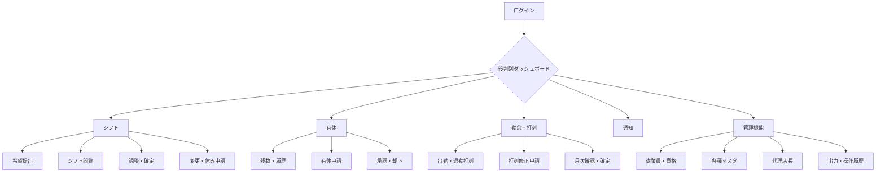

# シフト・有休管理アプリ 要件定義書

## 1. 文書情報

| 項目 | 内容 |
|---|---|
| 文書名 | シフト・有休管理アプリ 要件定義書 |
| 作成日 | 2026年6月17日 |
| 対象 | PC・スマートフォン対応Webアプリケーション |
| 対応言語 | 日本語・英語 |
| 想定利用者数 | 約100名 |

## 2. システム導入の目的

本システムは、複数の営業所・部署に所属する従業員のシフト、有休、勤怠を一元管理することを目的とする。

- 従業員による希望シフト提出をオンライン化する。
- 店長によるシフト調整・確定作業を効率化する。
- 有休申請、承認、残数管理を一元化する。
- 出退勤実績、遅刻、早退、残業、打刻漏れを可視化する。
- 営業所・部署・全社単位の勤務状況をダッシュボードで把握する。
- 申請・承認・変更などの操作履歴を残し、管理の透明性を高める。

## 3. 対象組織

### 3.1 営業所

1. 本社
2. 北部支店
3. 中部支店
4. 那覇支店
5. 南部支店
6. 宮古支店
7. 石垣支店

### 3.2 部署

1. 営業部
2. 経理部
3. 総務部
4. 人事部

### 3.3 雇用形態

- 正社員
- 契約社員
- パート
- アルバイト

## 4. 利用者と権限

| 利用者 | 閲覧範囲 | 主な操作 |
|---|---|---|
| 従業員 | 自分の情報、および同じ営業所・部署の従業員の公開シフト | 希望シフト提出、有休申請、シフト変更・休み申請、打刻、打刻修正申請、自分の勤怠・有休・通知確認 |
| 店長 | 担当する1営業所・1部署 | シフト調整・確定、各種申請の承認・却下、勤怠確認・確定、確定解除、必要人数の確認 |
| 代理店長 | 指定された不在期間中の担当営業所・部署 | 店長に代わる有休、シフト変更、打刻修正などの承認・却下 |
| 人事担当者 | 全営業所・全部署 | 従業員・各種マスタ管理、全社情報の閲覧、店長確定後の勤怠確認、操作履歴確認、データ出力 |

### 4.1 権限制御

- 従業員は、他の従業員の有休申請理由、勤怠詳細、位置情報を閲覧できない。
- 他の従業員の有休は、シフト表上で「有休」とだけ表示する。
- 有休申請理由は、申請者本人、担当店長、代理店長、人事担当者のみ閲覧できる。
- 打刻時の位置情報は、本人、担当店長、代理店長、人事担当者のみ閲覧できる。
- 店長は1つの営業所・部署に所属し、その範囲だけを管理する。
- 人事担当者は全社情報を閲覧・管理できる。

## 5. 業務ルール

### 5.1 勤務区分

| 区分 | 時間 | 休憩 | 実働 | 備考 |
|---|---:|---:|---:|---|
| 日勤 | 8:00～17:00 | 1時間 | 8時間 | 必要人数5名 |
| 夜勤 | 17:00～翌8:00 | 2時間 | 13時間 | 必要人数7名。開始日の勤務として集計 |
| 夜勤明け | 夜勤終了後～翌8:00 | なし | 勤務時間に含めない | 新たなシフトを入れない休息期間 |
| 午前休 | 13:00～17:00に勤務 | なし | 4時間 | 8:00～12:00を半日有休として扱う |
| 午後休 | 8:00～12:00に勤務 | なし | 4時間 | 13:00～17:00を半日有休として扱う |
| 休み | 終日 | なし | 0時間 | 希望シフトで選択可能 |
| 有休 | 1日・半日・時間単位 | なし | 取得単位に応じる | 希望シフトまたは有休申請で指定 |

### 5.2 シフト提出・調整

- 従業員は翌月分の希望シフトを1か月単位で提出する。
- 提出期限は毎月15日とする。
- 毎月14日に、希望シフト未提出者へアプリ内通知とメール通知を送る。
- 従業員は日ごとに「日勤・夜勤・休み・有休」を選択する。
- 店長はカレンダー上で従業員ごとの勤務区分を調整する。
- 店長は日勤5名、夜勤7名の必要人数を確認してシフトを確定する。
- 必要人数を下回る勤務帯は「人員不足」として表示する。
- 確定時に警告が残っている場合は、内容を明示して店長に確認を求める。

### 5.3 シフトチェック

確定前に、少なくとも次の内容を自動チェックする。

- 夜勤明けの休息期間への勤務登録
- 同一従業員の勤務時間帯の重複
- 日勤・夜勤の必要人数不足
- 有休残数不足

### 5.4 確定後の変更

- 従業員は確定後のシフト変更または休みを申請できる。
- 原則として勤務日の前日まで申請を受け付ける。
- 緊急時は当日申請も許可する。
- 変更は担当店長または権限期間中の代理店長の承認後に反映する。
- 変更後に本人へアプリ内通知とメール通知を送る。

### 5.5 有休

- 従業員は取得日、取得単位、理由を入力して申請する。
- 取得単位は1日、午前休、午後休、1時間単位とする。
- 1日分は8時間として換算する。
- 時間単位有休は年5日分、合計40時間までとする。
- 有休は担当店長または権限期間中の代理店長の承認だけで確定する。
- 有休残数および時間単位有休の年間利用上限を超える申請はできない。
- 有休は入社日を基準に、適用時点の法令上の一般的な付与ルールに従って自動付与する。
- 付与、取得、取消、失効の履歴を記録する。
- 法令改正に対応できるよう、付与ルールは設定可能な構造とする。

### 5.6 勤怠

- 従業員はPCまたはスマートフォンから出勤・退勤を打刻できる。
- 打刻場所は制限せず、打刻時の位置情報を記録する。
- 位置情報を取得できなかった場合はその旨を記録し、利用者へ表示する。
- 打刻時刻は1分単位で記録する。
- 日勤は1時間、夜勤は2時間の休憩を勤務実績から自動で差し引く。
- 確定シフトと打刻を比較し、遅刻、早退、打刻漏れを自動表示する。
- 予定実働時間を超えた時間を残業時間として自動表示する。
- 夜勤実績は勤務開始日に帰属させる。

### 5.7 打刻修正

- 従業員は打刻忘れや誤りについて、修正後の時刻と理由を入力して申請する。
- 担当店長または権限期間中の代理店長が承認・却下する。
- 承認前の値、申請値、承認後の値を履歴として保持する。

### 5.8 月次勤怠確定

1. 店長が担当範囲の各従業員の勤怠を確認する。
2. 店長が月次勤怠を確定する。
3. 人事担当者が全社の確定済み勤怠を確認する。
4. 確定後の勤怠は編集不可とする。
5. 修正が必要な場合は、担当店長が確定を解除する。
6. 確定解除および再確定を操作履歴へ記録する。

## 6. 機能要件

### 6.1 認証・アカウント

- 人事担当者が従業員アカウントを登録する。
- システムは登録されたメールアドレスへ招待メールを送る。
- 従業員は招待メールから初回パスワードを設定する。
- メールアドレスとパスワードでログインする。
- ログアウト、パスワード変更、パスワード再設定に対応する。
- 無効化されたアカウントはログインできない。

### 6.2 従業員管理

人事担当者は次の情報を登録・編集・無効化できる。

- 氏名
- 社員番号
- メールアドレス
- 入社日
- 営業所
- 部署
- 役割
- 雇用形態
- 資格情報

資格情報は資格名と有効期限を登録する。配置人数の判定には使用しない。有効期限が切れた情報も履歴として保持する。

### 6.3 マスタ管理

人事担当者は次の設定を管理できる。

- 営業所
- 部署
- 勤務区分と勤務時間
- 勤務区分ごとの休憩時間
- 勤務区分ごとの必要人数
- 雇用形態
- 資格名称
- 対応言語

### 6.4 代理店長管理

- 店長または人事担当者は、同じ営業所・部署の従業員から代理店長を選択する。
- 代理権限の開始日・終了日を指定する。
- 権限は指定期間だけ有効とする。
- 指定期間外は店長向け機能へアクセスできない。
- 代理店長による操作は本人の操作として履歴に記録する。

### 6.5 ダッシュボード

添付イメージを参考に、サイドナビゲーション、ヘッダー、指標、一覧、推移グラフから構成する。

#### 共通表示

- 今日の日付
- 利用者名、役割、所属
- 未読通知件数
- 言語切替
- ログアウト

#### 従業員向け

- 自分の本日の勤務区分と打刻状況
- 自分の未完了申請
- 自分の有休残日数・残時間
- 自分の月間予定勤務時間・実勤務時間・残業時間
- 自分の月別勤務時間・残業時間・有休取得数の推移

#### 店長・代理店長向け

- 担当営業所・部署の今日の勤務者
- 未承認申請件数と申請一覧
- 日勤・夜勤の人員不足
- 従業員ごとの有休残日数
- 月間勤務時間・残業時間・有休取得数の推移
- 未提出者、遅刻、早退、打刻漏れ、未確定勤怠の件数

#### 人事担当者向け

- 全社、営業所別、部署別の今日の勤務者
- 全社の未承認申請状況
- 営業所・部署別の人員不足
- 全従業員の有休残日数
- 月間勤務時間・残業時間・有休取得数の推移
- 営業所・部署・期間による絞り込み

### 6.6 通知

通知はアプリ内通知とメール通知の両方に対応する。

| 通知 | 主な宛先 | タイミング |
|---|---|---|
| 希望シフト提出期限前 | 未提出の従業員 | 毎月14日 |
| シフト確定 | 対象従業員 | 店長の確定時 |
| シフト変更 | 対象従業員 | 変更の承認・反映時 |
| 有休申請 | 担当店長・有効期間中の代理店長 | 申請時 |
| 有休承認・却下 | 申請者 | 処理時 |
| シフト変更・休み申請 | 担当店長・有効期間中の代理店長 | 申請時 |
| 打刻修正申請 | 担当店長・有効期間中の代理店長 | 申請時 |
| 各申請の承認・却下 | 申請者 | 処理時 |

- アプリ内通知には既読・未読状態を持たせる。
- 通知から対象の申請・シフト・勤怠画面へ移動できるようにする。
- メール本文には、機微情報を必要以上に記載しない。

### 6.7 データ出力・印刷

- シフト表、勤怠実績、有休取得状況をExcel形式で出力できる。
- シフト表、勤怠実績、有休取得状況をCSV形式で出力できる。
- 出力範囲を期間、営業所、部署、従業員で絞り込める。
- 月間シフト表を印刷に適した形式で表示・印刷できる。
- 権限で許可された範囲のデータだけを出力できる。

### 6.8 操作履歴

次の操作について、実行者、日時、対象、変更前、変更後を記録する。

- シフトの提出、調整、確定、変更
- 有休の申請、承認、却下、取消
- 打刻および打刻修正の申請、承認、却下
- 月次勤怠の確定、確定解除、再確定
- 従業員情報・資格情報・マスタの登録、変更、無効化
- 代理店長の設定、変更、解除

人事担当者は期間、実行者、操作種別、対象者で履歴を検索できる。

## 7. 画面要件

### 7.1 共通レイアウト

- PCではヘッダーと左サイドナビゲーションを共通表示する。
- スマートフォンではサイドナビゲーションをメニュー内に収納する。
- ヘッダーに利用者情報、通知、言語切替、ログアウトを配置する。
- 一覧、入力、確認ダイアログ、エラー表示のデザインと操作を統一する。
- 役割に応じて使用可能なメニューだけを表示する。
- PCとスマートフォンで同一機能を提供し、画面幅に応じてレイアウトを切り替える。

### 7.2 画面一覧

#### 共通・認証

1. ログイン画面
2. 招待確認・初回パスワード設定画面
3. パスワード再設定依頼画面
4. パスワード再設定画面
5. ダッシュボード
6. 通知一覧画面
7. アカウント設定・パスワード変更画面

#### シフト

8. 自分のシフトカレンダー画面
9. 希望シフト入力・提出画面
10. 同一営業所・部署の月間シフト表画面
11. シフト変更・休み申請画面
12. シフト申請履歴・詳細画面
13. 店長用シフト調整画面
14. 店長用シフト確定確認画面
15. 月間シフト印刷画面

#### 有休

16. 有休残数・取得履歴画面
17. 有休申請画面
18. 有休申請履歴・詳細画面
19. 有休承認一覧・詳細画面

#### 勤怠

20. 出勤・退勤打刻画面
21. 自分の勤怠一覧・詳細画面
22. 打刻修正申請画面
23. 打刻修正申請履歴・詳細画面
24. 店長用勤怠確認・月次確定画面
25. 人事用全社勤怠確認画面

#### 管理・出力

26. 従業員一覧画面
27. 従業員登録・編集・詳細画面
28. 資格情報管理画面
29. 代理店長設定画面
30. 営業所管理画面
31. 部署管理画面
32. 勤務区分・休憩時間管理画面
33. 必要人数管理画面
34. 雇用形態・資格名称管理画面
35. データ出力画面
36. 操作履歴一覧・詳細画面

### 7.3 主な画面遷移

## 8. データ要件

主な管理対象は次のとおりとする。

- 利用者・認証情報
- 従業員プロフィール
- 営業所・部署
- 雇用形態・資格情報
- 役割・代理権限期間
- 勤務区分・勤務時間・休憩時間・必要人数
- 希望シフト・確定シフト・シフト変更申請
- 有休付与・取得・残数・申請
- 出退勤打刻・位置情報・打刻修正申請
- 月次勤怠確定状態
- アプリ内通知・メール送信結果
- 操作履歴

### 8.1 保存期間

- シフト、勤怠、有休、操作履歴、位置情報は5年間保存する。
- 保存期間を過ぎたデータは、権限を持つ管理者による所定の処理で削除または匿名化する。
- アカウントを無効化しても、保存義務期間中の業務記録は保持する。

## 9. 非機能要件

### 9.1 対応環境

- PC: 最新版および1世代前のGoogle Chrome、Microsoft Edge
- iPhone: 最新版および1世代前のiOS標準ブラウザ
- Android: 最新版および1世代前の標準ブラウザまたはGoogle Chrome
- レスポンシブデザインにより、PC・スマートフォンで同一機能を利用可能とする。

### 9.2 性能・利用規模

- 登録利用者約100名を想定する。
- 通常の画面表示、検索、保存は、一般的な通信環境で原則3秒以内を目標とする。
- Excel・CSV出力など時間を要する処理は、処理中であることを画面に表示する。
- 最大同時利用者数は、設計開始前に別途確認する。

### 9.3 セキュリティ・プライバシー

- 通信を暗号化する。
- パスワードを復元できない形式で安全に保存する。
- 役割、営業所、部署に基づいてサーバー側でアクセスを制御する。
- 一定時間操作がない場合はセッションを終了する。
- ログイン試行回数を制限し、不正な繰り返し試行を防止する。
- 個人情報、有休理由、位置情報、資格情報の閲覧を必要な利用者に限定する。
- 位置情報を取得・保存する目的と保存期間を利用者へ明示し、端末の許可を得て取得する。
- Excel・CSV出力および操作履歴の閲覧も記録する。

### 9.4 可用性・保全

- 業務データを定期的にバックアップする。
- 障害発生時に、バックアップから復旧できるようにする。
- メール送信に失敗した場合もアプリ内通知を残し、送信結果を管理者が確認できるようにする。
- 日付・時刻は日本標準時で管理・表示する。

### 9.5 操作性・アクセシビリティ

- 日本語と英語を画面上で切り替えられる。
- 入力エラーは対象項目の近くに、修正方法が分かる文言で表示する。
- 色だけに依存せず、文字やアイコンでも状態を区別する。
- スマートフォンの主要操作は片手でも押しやすいサイズで表示する。
- 位置情報を取得できない場合も、原因と次の操作を分かりやすく案内する。

## 10. 主要な受入条件

1. 従業員が翌月分の希望シフトを提出でき、毎月14日に未提出者だけへ通知されること。
2. 店長が担当営業所・部署のシフトを調整し、人員不足などの警告を確認して確定できること。
3. 確定シフトが同じ営業所・部署の従業員に公開されること。
4. 夜勤が開始日の勤務として実働13時間で集計され、夜勤明けの休息期間への勤務登録が警告されること。
5. 従業員が1日、半日、1時間単位の有休を申請でき、店長または有効期間中の代理店長が処理できること。
6. 有休残数と時間単位有休の年間上限が正しく判定されること。
7. PC・スマートフォンから打刻でき、時刻と位置情報が記録されること。
8. 確定シフトと打刻から遅刻、早退、打刻漏れ、残業時間が表示されること。
9. 打刻修正申請と承認ができ、変更前後の値が履歴に残ること。
10. 店長が月次勤怠を確定でき、人事担当者が全社分を確認できること。
11. 確定後は編集不可となり、店長の確定解除後だけ修正できること。
12. 役割と所属に応じて閲覧・操作範囲が制限されること。
13. ダッシュボードに今日の勤務者、未承認申請、有休残日数、人員不足、月間勤務時間が役割別の範囲で表示されること。
14. 月別の勤務時間、残業時間、有休取得数をグラフで確認できること。
15. 対象データをExcel・CSVで出力でき、月間シフト表を印刷できること。
16. 日本語・英語の表示切替ができ、PCとスマートフォンですべての機能を利用できること。
17. シフト、勤怠、有休、操作履歴、位置情報が5年間保存されること。

## 11. 前提・制約

- 本システムはWebアプリケーションとして提供する。
- 打刻時の位置情報は不正判定や打刻制限には使用せず、記録・確認用途だけに使用する。
- 資格情報は資格名と有効期限の管理に使用し、シフトの必要人数・配置条件には使用しない。
- 有休の自動付与は日本の適用法令に準拠し、詳細仕様は開発時点の法令および会社の就業規則との整合を確認する。
- シフト確定前の警告は表示する。警告がある状態での確定を禁止するかどうかは、未確定事項として別途決定する。

## 12. 未確定事項

開発着手前に、次の内容を決定する必要がある。

1. 最大同時利用者数および利用が集中する時間帯
2. 警告が残るシフトの確定を禁止するか、理由入力により許可するか
3. 有休申請の受付期限、取消期限、過去日申請の可否
4. シフト変更・休みの当日緊急申請を識別する方法と承認期限
5. 祝日、会社休日、営業所独自休日を管理する必要性
6. 残業について、表示だけでなく事前申請・承認を行う必要性
7. 月次勤怠の締め日と店長・人事担当者の確認期限
8. 退職者データの無効化日と閲覧可能期間
9. 法令および就業規則に基づく有休の出勤率判定、繰越、失効、休職期間などの詳細計算ルール
10. メール送信元、メール文面、再送回数
11. バックアップ頻度、復旧目標、保守時間帯
12. 位置情報を端末側で拒否した場合に打刻を許可するかどうか

## 13. 対象外

現時点では、次の機能を対象外とする。

- 給与計算および給与明細発行
- シフト条件に基づく自動シフト作成
- 資格保有者数を考慮した自動配置判定
- GPSによる勤務場所の制限または自動的な不正打刻判定
- 顔認証、ICカード、生体認証による打刻
- 外部給与・人事システムとの自動連携

